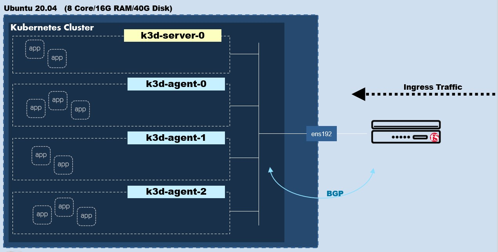

# lab-k3d-k3s-bigip

## Architecture
  

## Install docker on Ubuntu.
```
sudo apt-get update

sudo apt-get -y install \
    apt-transport-https \
    ca-certificates \
    curl \
    gnupg-agent \
    software-properties-common

curl -fsSL https://download.docker.com/linux/ubuntu/gpg | sudo apt-key add -

sudo add-apt-repository \
   "deb [arch=amd64] https://download.docker.com/linux/ubuntu \
   $(lsb_release -cs) \
   stable"

sudo apt-get update -y

sudo apt-get install docker-ce=5:19.03.15~3-0~ubuntu-focal docker-ce-cli=5:19.03.15~3-0~ubuntu-focal -y

fbchan@sky:~$ docker ps
CONTAINER ID   IMAGE     COMMAND   CREATED   STATUS    PORTS     NAMES
fbchan@sky:~$

sudo systemctl enable --now docker.service
```

## Install Helm on ubuntu
```
curl -fsSL -o get_helm.sh https://raw.githubusercontent.com/helm/helm/master/scripts/get-helm-3
chmod 700 get_helm.sh
./get_helm.sh
```

## Install Calico
```
curl -O -L https://github.com/projectcalico/calicoctl/releases/download/v3.15.0/calicoctl
chmod u+x calicoctl
sudo mv calicoctl /usr/local/bin/
```

## Install kubectl on Unbutu.
```
curl -LO https://dl.k8s.io/release/v1.19.9/bin/linux/amd64/kubectl
chmod u+x kubectl
sudo mv kubectl /usr/local/bin
```

## Install other tools.
```
sudo apt install jq -y
sudo apt install net-tools -y
```

## Install k9s on ubuntu.
```
wget https://github.com/derailed/k9s/releases/download/v0.24.2/k9s_Linux_x86_64.tar.gz
tar zxvf k9s_Linux_x86_64.tar.gz
sudo mv k9s /usr/local/bin/
```

## Disable and remove FW on ubuntu.
```
sudo ufw disable
sudo apt-get remove ufw -y
```

## Install k3s on Ubuntu.
```
wget -q -O - https://raw.githubusercontent.com/rancher/k3d/main/install.sh | TAG=v4.2.0 bash
```

# Create K3s Cluster
```
k3d cluster create cpaas1 --image docker.io/rancher/k3s:v1.19.9-k3s1 \
--k3s-server-arg "--disable=servicelb" \
--k3s-server-arg "--disable=traefik" \
--k3s-server-arg --tls-san="10.42.0.10" \
--k3s-server-arg --tls-san="k3s.yshin.work" \
--k3s-server-arg '--flannel-backend=none' \
--volume "$(pwd)/calico-k3d.yaml:/var/lib/rancher/k3s/server/manifests/calico.yaml" \
--no-lb --servers 1 --agents 3
```
## kubectl get pods
```
kubectl get pod -A
```

## Setup calico on kubernetes
```
sudo mkdir /etc/calico
sudo vi /etc/calico/calicoctl.cfg

Content of calicoctl.cfg. (replace /home/xxxx/.kube/config with the location of you kubeconfig file)
---------------------------------------
apiVersion: projectcalico.org/v3
kind: CalicoAPIConfig
metadata:
spec:
  datastoreType: "kubernetes"
  kubeconfig: "/home/ubuntu/.kube/config"
--------------------------------------

sudo calicoctl create -f bgp-config.yml
sudo calicoctl create -f bgp-peer.yml
sudo calicoctl get node -o wide
```

---

## login bigip
```
ssh root@10.42.0.11  (default password is "default")
```

## bigip license activate.
```
tmsh modify auth password-policy policy-enforcement disabled
tmsh modify auth password admin 
tmsh modify auth password root 
tmsh modify sys global-settings mgmt-dhcp disabled 
tmsh create sys management-ip 1.1.1.1/32 
tmsh create net vlan internal interfaces add { 1.1 } 
tmsh create net self 10.42.0.11/16 vlan internal allow-service default 
tmsh create net route default 10.42.0.254
tmsh create net route default gw 10.42.0.254 
tmsh modify cli global-settings service number
tmsh modify sys global-settings gui-setup disabled
tmsh save sys config 
dig +nocookie www.google.com
SOAPLicenseClient --basekey CEDMQ-QUVEO-WOBRE-VYSMA-PQFVBCW
grep nw_routing_bgp bigip.license 
```


## bigip setup.
```
#https://github.com/F5Networks/f5-appsvcs-extension/releases/latest
curl -LO https://github.com/F5Networks/f5-appsvcs-extension/releases/download/v3.29.0/f5-appsvcs-3.29.0-3.noarch.rpm
vi install-rpm.sh
---------------------
#!/bin/bash
# how to use :
# chmod +x install-rpm.sh
# ./install-rpm.sh <IP address of BIG-IP> <username>:<password> <path to RPM>

set -e

if [ -z "$1" ]; then
    echo "Target machine is required for installation."
    exit 0
fi

if [ -z "$2" ]; then
    echo "Credentials [username:password] for target machine are required for installation."
    exit 0
fi

if [ -z "$3" ]; then
    echo "File path to RPM is required for installation."
    exit 0
fi

TARGET="$1"
CREDS="$2"
TARGET_RPM="$3"
RPM_NAME=$(basename $TARGET_RPM)
CURL_FLAGS="--silent --write-out \n --insecure -u $CREDS"

poll_task () {
    STATUS="STARTED"
    while [ $STATUS != "FINISHED" ]; do
        sleep 1
        RESULT=$(curl ${CURL_FLAGS} "https://$TARGET/mgmt/shared/iapp/package-management-tasks/$1")
        STATUS=$(echo $RESULT | jq -r .status)
        if [ $STATUS = "FAILED" ]; then
            echo "Failed to" $(echo $RESULT | jq -r .operation) "package:" \
                $(echo $RESULT | jq -r .errorMessage)
            exit 1
        fi
    done
}

#Get list of existing f5-appsvcs packages on target
TASK=$(curl $CURL_FLAGS -H "Content-Type: application/json" \
    -X POST https://$TARGET/mgmt/shared/iapp/package-management-tasks -d "{operation: 'QUERY'}")
poll_task $(echo $TASK | jq -r .id)
AS3RPMS=$(echo $RESULT | jq -r '.queryResponse[].packageName | select(. | startswith("f5-appsvcs"))')

#Uninstall existing f5-appsvcs packages on target
for PKG in $AS3RPMS; do
    echo "Uninstalling $PKG on $TARGET"
    DATA="{\"operation\":\"UNINSTALL\",\"packageName\":\"$PKG\"}"
    TASK=$(curl ${CURL_FLAGS} "https://$TARGET/mgmt/shared/iapp/package-management-tasks" \
        --data $DATA -H "Origin: https://$TARGET" -H "Content-Type: application/json;charset=UTF-8")
    poll_task $(echo $TASK | jq -r .id)
done

#Upload new f5-appsvcs RPM to target
echo "Uploading RPM to https://$TARGET/mgmt/shared/file-transfer/uploads/$RPM_NAME"
LEN=$(wc -c $TARGET_RPM | awk 'NR==1{print $1}')
RANGE_SIZE=5000000
CHUNKS=$(( $LEN / $RANGE_SIZE))
for i in $(seq 0 $CHUNKS); do
    START=$(( $i * $RANGE_SIZE))
    END=$(( $START + $RANGE_SIZE))
    END=$(( $LEN < $END ? $LEN : $END))
    OFFSET=$(( $START + 1))
    curl ${CURL_FLAGS} -o /dev/null --write-out "" \
        https://$TARGET/mgmt/shared/file-transfer/uploads/$RPM_NAME \
        --data-binary @<(tail -c +$OFFSET $TARGET_RPM) \
        -H "Content-Type: application/octet-stream" \
        -H "Content-Range: $START-$(( $END - 1))/$LEN" \
        -H "Content-Length: $(( $END - $START ))" \
        -H "Connection: keep-alive"
done

#Install f5-appsvcs on target
echo "Installing $RPM_NAME on $TARGET"
DATA="{\"operation\":\"INSTALL\",\"packageFilePath\":\"/var/config/rest/downloads/$RPM_NAME\"}"
TASK=$(curl ${CURL_FLAGS} "https://$TARGET/mgmt/shared/iapp/package-management-tasks" \
    --data $DATA -H "Origin: https://$TARGET" -H "Content-Type: application/json;charset=UTF-8")
poll_task $(echo $TASK | jq -r .id)

echo "Waiting for /info endpoint to be available"
until curl ${CURL_FLAGS} -o /dev/null --write-out "" --fail --silent \
    "https://$TARGET/mgmt/shared/appsvcs/info"; do
    sleep 1
done

echo "Installed $RPM_NAME on $TARGET"

exit 0
---------------------

chmod +x install-rpm.sh
./install-rpm.sh 10.42.0.11 admin:admin ./f5-appsvcs-3.29.0-3.noarch.rpm 
curl -ks -u admin:admin https://10.42.0.11/mgmt/shared/appsvcs/info |jq .
```


## BGP setup on bigip.
```
tmsh modify net route-domain 0 routing-protocol add { BGP } 
tmsh create auth partition kubernetes

imish
enable
configure terminal
router bgp 64512
bgp graceful-restart restart-time 120
neighbor calico-k8s peer-group
neighbor calico-k8s remote-as 64512
neighbor 172.18.0.2 peer-group calico-k8s
neighbor 172.18.0.3 peer-group calico-k8s
neighbor 172.18.0.4 peer-group calico-k8s
neighbor 172.18.0.5 peer-group calico-k8s
write
end
show running-config
exit
```


## Route add on bigip.
```
tmsh create net route ubuntu-k3d network 172.18.0.0/16 gw 10.42.0.10
```

## Route add on ubuntu. 
```
sudo ip route add 10.53.86.64/26 via 172.18.0.3
sudo ip route add 10.53.68.192/26 via 172.18.0.4
sudo ip route add 10.53.115.0/26 via 172.18.0.5
sudo ip route add 10.53.194.192/26 via 172.18.0.2

```


# install f5-cis on kubernetes.
```
kubectl create secret generic bigip-login -n kube-system --from-literal=username=admin --from-literal=password=admin
kubectl create serviceaccount k8s-bigip-ctlr -n kube-system
kubectl create clusterrolebinding k8s-bigip-ctlr-clusteradmin --clusterrole=cluster-admin --serviceaccount=kube-system:k8s-bigip-ctlr
```

```
vi f5-cluster-deployment.yaml
---
apiVersion: apps/v1
kind: Deployment
metadata: 
  name: k8s-bigip-ctlr-deployment
  namespace: kube-system
spec: 
  progressDeadlineSeconds: 600
  replicas: 1
  revisionHistoryLimit: 10
  selector: 
    matchLabels: 
      app: k8s-bigip-ctlr
  strategy: 
    rollingUpdate: 
      maxSurge: 1
      maxUnavailable: 1
    type: RollingUpdate
  template: 
    metadata: 
      annotations: 
        seccomp.security.alpha.kubernetes.io/defaultProfileName: unconfined
        seccomp.security.alpha.kubernetes.io/pod: unconfined
      creationTimestamp: ~
      labels: 
        app: k8s-bigip-ctlr
      name: k8s-bigip-ctlr
    spec: 
      containers: 
        - 
          args: 
            - "--bigip-username=$(BIGIP_USERNAME)"
            - "--bigip-password=$(BIGIP_PASSWORD)"
            - "--bigip-url=10.42.0.11"
            - "--bigip-partition=kubernetes"
            - "--namespace=default"
            - "--pool-member-type=cluster"
            - "--log-level=DEBUG"
            - "--insecure=true"
            - "--custom-resource-mode=true"
            - "--as3-validation=true"
            - "--log-as3-response=true"
            - "--ipam=true"
          command: 
            - /app/bin/k8s-bigip-ctlr
          env: 
            - 
              name: BIGIP_USERNAME
              valueFrom: 
                secretKeyRef: 
                  key: username
                  name: bigip-login
            - 
              name: BIGIP_PASSWORD
              valueFrom: 
                secretKeyRef: 
                  key: password
                  name: bigip-login
          image: "f5networks/k8s-bigip-ctlr:2.5.0"
          name: f5-server
      serviceAccountName: k8s-bigip-ctlr
---
```

```
vi customresourcedefinitions.yaml
---
apiVersion: apiextensions.k8s.io/v1
kind: CustomResourceDefinition
metadata:
  name: virtualservers.cis.f5.com
spec:
  group: cis.f5.com
  names:
    kind: VirtualServer
    plural: virtualservers
    shortNames:
      - vs
    singular: virtualserver
  scope: Namespaced
  versions:
    -
      name: v1
      served: true
      storage: true
      schema:
        openAPIV3Schema:
          type: object
          properties:
            spec:
              type: object
              properties:
                host:
                  type: string
                  pattern: '^(([a-zA-Z0-9]|[a-zA-Z0-9][a-zA-Z0-9\-]*[a-zA-Z0-9])\.)*([A-Za-z0-9]|[A-Za-z0-9][A-Za-z0-9\-]*[A-Za-z0-9])$'
                httpTraffic:
                  type: string
                ipamLabel:
                  type: string
                snat:
                  type: string
                tlsProfileName:
                  type: string
                rewriteAppRoot:
                  type: string
                  pattern: '^\/([A-z0-9-_+]+\/)*([A-z0-9]+\/?)*$'
                waf:
                  type: string
                  pattern: '^\/([A-z0-9-_+]+\/)*([A-z0-9]+\/?)*$'
                allowVlans:
                  items:
                    type: string
                    pattern: '^\/([A-z0-9-_+]+\/)*([A-z0-9-_]+\/?)*$'
                  type: array
                iRules:
                  type: array
                  items:
                    type: string
                serviceAddress:
                  type: array
                  maxItems: 1
                  items:
                    type: object
                    properties:
                      arpEnabled:
                        type: boolean
                      icmpEcho:
                        type: string
                        enum: [enable, disable, selective]
                      routeAdvertisement:
                        type: string
                        enum: [enable, disable, selective, always, any, all]
                      spanningEnabled:
                        type: boolean
                      trafficGroup:
                        type: string
                        pattern: '^\/([A-z0-9-_+]+\/)*([A-z0-9]+\/?)*$'
                pools:
                  type: array
                  items:
                    type: object
                    properties:
                      path:
                        type: string
                        pattern: '^\/([A-z0-9-_+]+\/)*([A-z0-9]+\/?)*$'
                      service:
                        type: string
                        pattern: '^([A-z0-9-_+])*([A-z0-9])$'
                      nodeMemberLabel:
                        type: string
                        pattern: '^[a-zA-Z0-9][-A-Za-z0-9_.]{0,61}[a-zA-Z0-9]=[a-zA-Z0-9][-A-Za-z0-9_.]{0,61}[a-zA-Z0-9]$'
                      servicePort:
                        type: integer
                        minimum: 1
                        maximum: 65535
                      rewrite:
                        type: string
                        pattern: '^\/([A-z0-9-_+]+\/)*([A-z0-9]+\/?)*$'
                      monitor:
                        type: object
                        properties:
                          type:
                            type: string
                            enum: [http, https]
                          send:
                            type: string
                          recv:
                            type: string
                          interval:
                            type: integer
                          timeout:
                            type: integer
                        required:
                          - type
                          - send
                          - interval
                virtualServerAddress:
                  type: string
                  pattern: '^(([0-9]|[1-9][0-9]|1[0-9]{2}|2[0-4][0-9]|25[0-5])\.){3}([0-9]|[1-9][0-9]|1[0-9]{2}|2[0-4][0-9]|25[0-5])$'
                virtualServerName:
                  type: string
                  pattern: '^([A-z0-9-_+])*([A-z0-9])$'
                virtualServerHTTPPort:
                  type: integer
                  minimum: 1
                  maximum: 65535
                virtualServerHTTPSPort:
                  type: integer
                  minimum: 1
                  maximum: 65535
            status:
              type: object
              properties:
                vsAddress:
                  type: string
      additionalPrinterColumns:
        - name: host
          type: string
          description: hostname
          jsonPath: .spec.host
        - name: tlsProfileName
          type: string
          description: TLS Profile attached
          jsonPath: .spec.tlsProfileName
        - name: httpTraffic
          type: string
          description: Http Traffic Termination
          jsonPath: .spec.httpTraffic
        - name: IPAddress
          type: string
          description: IP address of virtualServer
          jsonPath: .spec.virtualServerAddress
        - name: ipamLabel
          type: string
          description: ipamLabel for virtual server
          jsonPath: .spec.ipamLabel
        - name: IPAMVSAddress
          type: string
          description: IP address of virtualServer
          jsonPath: .status.vsAddress
        - name: Age
          type: date
          jsonPath: .metadata.creationTimestamp
      subresources:
        status: {}
          
---
apiVersion: apiextensions.k8s.io/v1
kind: CustomResourceDefinition
metadata:
  name: tlsprofiles.cis.f5.com
spec:
  group: cis.f5.com
  names:
    kind: TLSProfile
    plural: tlsprofiles
    shortNames:
      - tls
    singular: tlsprofile
  scope: Namespaced
  versions:
    -
      name: v1
      served: true
      storage: true
      schema:
        openAPIV3Schema:
          type: object
          properties:
            spec:
              type: object
              properties:
                hosts:
                  type: array
                  items:
                    type: string
                    pattern: '^(([a-zA-Z0-9]|[a-zA-Z0-9][a-zA-Z0-9\-]*[a-zA-Z0-9])\.)*([A-Za-z0-9]|[A-Za-z0-9][A-Za-z0-9\-]*[A-Za-z0-9])$'
                tls:
                  type: object
                  properties:
                    termination:
                      type: string
                      enum: [edge, reencrypt, passthrough]
                    clientSSL:
                      type: string
                    serverSSL:
                      type: string
                    reference:
                      type: string
                  required:
                    - termination

---
apiVersion: apiextensions.k8s.io/v1
kind: CustomResourceDefinition
metadata:
  name: transportservers.cis.f5.com
spec:
  group: cis.f5.com
  names:
    kind: TransportServer
    plural: transportservers
    shortNames:
      - ts
    singular: transportserver
  scope: Namespaced
  versions:
    -
      name: v1
      served: true
      storage: true
      schema:
        openAPIV3Schema:
          type: object
          properties:
            spec:
              type: object
              properties:
                virtualServerAddress:
                  type: string
                  pattern: '^(([0-9]|[1-9][0-9]|1[0-9]{2}|2[0-4][0-9]|25[0-5])\.){3}([0-9]|[1-9][0-9]|1[0-9]{2}|2[0-4][0-9]|25[0-5])$'
                virtualServerPort:
                  type: integer
                  minimum: 1
                  maximum: 65535
                virtualServerName:
                  type: string
                  pattern: '^([A-z0-9-_+])*([A-z0-9])$'
                mode: 
                  type: string
                  enum: [standard, performance]
                type:
                  type: string
                  enum: [tcp, udp]
                snat:
                  type: string
                allowVlans:
                  items:
                    type: string
                    pattern: '^\/([A-z0-9-_+]+\/)*([A-z0-9-_]+\/?)*$'
                  type: array
                iRules:
                  type: array
                  items:
                    type: string
                ipamLabel:
                  type: string
                serviceAddress:
                  type: array
                  maxItems: 1
                  items:
                    type: object
                    properties:
                      arpEnabled:
                        type: boolean
                      icmpEcho:
                        type: string
                        enum: [enable, disable, selective]
                      routeAdvertisement:
                        type: string
                        enum: [enable, disable, selective, always, any, all]
                      spanningEnabled:
                        type: boolean
                      trafficGroup:
                        type: string
                        pattern: '^\/([A-z0-9-_+]+\/)*([A-z0-9]+\/?)*$'
                pool:
                  type: object
                  properties:
                    service:
                      type: string
                      pattern: '^([A-z0-9-_+])*([A-z0-9])$'
                    servicePort:
                      type: integer
                      minimum: 1
                      maximum: 65535
                    monitor:
                      type: object
                      properties:
                        type:
                          type: string
                          enum: [tcp, udp]
                        interval:
                          type: integer
                        timeout:
                          type: integer
                      required:
                        - type
                        - interval
                  required:
                      - service
                      - servicePort
              required:
                - virtualServerPort
                - pool
      additionalPrinterColumns:
      - name: virtualServerAddress
        type: string
        description: IP address of virtualServer
        jsonPath: .spec.virtualServerAddress
      - name: virtualServerPort
        type: integer
        description: Port of virtualServer
        jsonPath: .spec.virtualServerPort
      - name: pool
        type: string
        description: Name of service
        jsonPath: .spec.pool.service
      - name: poolPort
        type: string
        description: Port of service
        jsonPath: .spec.pool.servicePort
      - name: Age
        type: date
        jsonPath: .metadata.creationTimestamp
---
apiVersion: apiextensions.k8s.io/v1
kind: CustomResourceDefinition
metadata:
  name: externaldnss.cis.f5.com
spec:
  group: cis.f5.com
  names:
    kind: ExternalDNS
    plural: externaldnss
    shortNames:
      - edns
    singular: externaldns
  scope: Namespaced
  versions:
    -
      name: v1
      served: true
      storage: true
      schema:
        openAPIV3Schema:
          type: object
          properties:
            spec:
              type: object
              properties:
                domainName:
                  type: string
                  pattern: '^(([a-zA-Z0-9]|[a-zA-Z0-9][a-zA-Z0-9\-]*[a-zA-Z0-9])\.)*([A-Za-z0-9]|[A-Za-z0-9][A-Za-z0-9\-]*[A-Za-z0-9])$'
                dnsRecordType:
                  type: string
                  pattern: 'A'
                loadBalanceMethod:
                  type: string
                pools:
                  type: array
                  items:
                    type: object
                    properties:
                      name:
                        type: string
                        pattern: '^(([a-zA-Z0-9]|[a-zA-Z0-9][a-zA-Z0-9\-]*[a-zA-Z0-9])\.)*([A-Za-z0-9]|[A-Za-z0-9][A-Za-z0-9\-]*[A-Za-z0-9])$'
                      dataServerName:
                        type: string
                      dnsRecordType:
                        type: string
                        pattern: 'A'
                      loadBalanceMethod:
                        type: string
                      monitor:
                        type: object
                        properties:
                          type:
                            type: string
                            enum: [http, https]
                          send:
                            type: string
                          recv:
                            type: string
                          interval:
                            type: integer
                          timeout:
                            type: integer
                        required:
                          - type
                          - send
                          - interval
                    required:
                      - name
                      - dataServerName
              required:
                - domainName
      additionalPrinterColumns:
        - name: domainName
          type: string
          description: Domain name of virtual server resource
          jsonPath: .spec.domainName
        - name: Age
          type: date
          jsonPath: .metadata.creationTimestamp
---
apiVersion: apiextensions.k8s.io/v1
kind: CustomResourceDefinition
metadata:
  name: ingresslinks.cis.f5.com
spec:
  group: cis.f5.com
  names:
    kind: IngressLink
    shortNames:
      - il
    singular: ingresslink
    plural: ingresslinks
  scope: Namespaced
  versions:
    -
      name: v1
      served: true
      storage: true
      schema:
        openAPIV3Schema:
          type: object
          properties:
            spec:
              type: object
              properties:
                virtualServerAddress:
                  type: string
                  pattern: '^(([0-9]|[1-9][0-9]|1[0-9]{2}|2[0-4][0-9]|25[0-5])\.){3}([0-9]|[1-9][0-9]|1[0-9]{2}|2[0-4][0-9]|25[0-5])$'
                iRules:
                  type: array
                  items:
                    type: string
                selector:
                  properties:
                    matchLabels:
                      additionalProperties:
                        type: string
                      type: object
                  type: object
---
```
https://github.com/F5Networks/k8s-bigip-ctlr/blob/master/docs/config_examples/crd/CustomResource.md


```
kubectl create -f f5-cluster-deployment.yaml
kubectl create -f customresourcedefinitions.yaml
```


# Install F5-IPAM Controller

## IPAM RBAC
```
vi f5-ipam-rbac.yaml

kind: ClusterRole
apiVersion: rbac.authorization.k8s.io/v1
metadata:
  name: ipam-ctlr-clusterrole
rules:
  - apiGroups: ["fic.f5.com"]
    resources: ["f5ipams", "f5ipams/status"]
    verbs: ["get", "list", "watch", "update", "create", "patch", "delete"]
---
kind: ClusterRoleBinding
apiVersion: rbac.authorization.k8s.io/v1
metadata:
  name: ipam-ctlr-clusterrole-binding
  namespace: kube-system
roleRef:
  apiGroup: rbac.authorization.k8s.io
  kind: ClusterRole
  name: ipam-ctlr-clusterrole
subjects:
  - apiGroup: ""
    kind: ServiceAccount
    name: ipam-ctlr
    namespace: kube-system
---
apiVersion: v1
kind: ServiceAccount
metadata:
  name: ipam-ctlr
  namespace: kube-system
```

## IPAM CRD
```
vi f5-ipam-schema.yaml
---
apiVersion: apiextensions.k8s.io/v1
kind: CustomResourceDefinition
metadata:
  name: ipams.fic.f5.com
spec:
  group: fic.f5.com
  names:
    kind: IPAM
    listKind: IPAMList
    plural: ipams
    singular: ipam
  scope: Namespaced
  versions:
    - name: v1
      served: true
      storage: true
      schema:
        openAPIV3Schema:
          type: object
          properties:
            spec:
              type: object
              properties:
                hostSpecs:
                  type: array
                  items:
                    type: object
                    properties:
                      host:
                        type: string
                        pattern: '^(([a-zA-Z0-9]|[a-zA-Z0-9][a-zA-Z0-9\-]*[a-zA-Z0-9])\.)*([A-Za-z0-9]|[A-Za-z0-9][A-Za-z0-9\-]*[A-Za-z0-9])$'
                      key:
                        type: string
                      cidr:
                        type: string
                        pattern: '^(([0-9]|[1-9][0-9]|1[0-9]{2}|2[0-4][0-9]|25[0-5])\.){3}([0-9]|[1-9][0-9]|1[0-9]{2}|2[0-4][0-9]|25[0-5])(\/([0-9]|[1-2][0-9]|3[0-2]))$'
                      ipamLabel:
                        type: string
            status:
              type: object
              properties:
                ipStatus:
                  type: array
                  items:
                    type: object
                    properties:
                      host:
                        type: string
                        pattern: '^(([a-zA-Z0-9]|[a-zA-Z0-9][a-zA-Z0-9\-]*[a-zA-Z0-9])\.)*([A-Za-z0-9]|[A-Za-z0-9][A-Za-z0-9\-]*[A-Za-z0-9])$'
                      key:
                        type: string
                      cidr:
                        type: string
                        pattern: '^(([0-9]|[1-9][0-9]|1[0-9]{2}|2[0-4][0-9]|25[0-5])\.){3}([0-9]|[1-9][0-9]|1[0-9]{2}|2[0-4][0-9]|25[0-5])(\/([0-9]|[1-2][0-9]|3[0-2]))$'
                      ip:
                        type: string
                        pattern: '^(([0-9]|[1-9][0-9]|1[0-9]{2}|2[0-4][0-9]|25[0-5])\.){3}([0-9]|[1-9][0-9]|1[0-9]{2}|2[0-4][0-9]|25[0-5])$'
                      ipamLabel:
                        type: string
```


## F5 IPAM Deployment
```
vi f5-ipam-deployment.yaml

---
apiVersion: apps/v1
kind: Deployment
metadata:
  labels:
    name: f5-ipam-controller
  name: f5-ipam-controller
  namespace: kube-system
spec:
  replicas: 1
  selector:
    matchLabels:
      app: f5-ipam-controller
  template:
    metadata:
      labels:
        app: f5-ipam-controller
    spec:
      containers:
      - args:
        - --orchestration=kubernetes
        - --ip-range='{"Test":"10.42.0.12-10.42.0.14","Production":"10.42.0.15-10.42.0.20"}'
        - --log-level=DEBUG
        command:
        - /app/bin/f5-ipam-controller
        image:  f5networks/f5-ipam-controller:0.1.2
        imagePullPolicy: IfNotPresent
        name: f5-ipam-controller
      serviceAccount: ipam-ctlr
      serviceAccountName: ipam-ctlr
```


```
kubectl create -f f5-ipam-rbac.yaml
kubectl create -f f5-ipam-schema.yaml
kubectl create -f f5-ipam-deployment.yaml
```

---
# TEST

## type: LoadBalancer
```
vi f5-demo-test-deployment.yaml
---
apiVersion: apps/v1
kind: Deployment
metadata:
  labels:
    app: f5-demo-test
  name: f5-demo-test
spec:
  replicas: 2
  selector:
    matchLabels:
      app: f5-demo-test
  template:
    metadata:
      labels:
        app: f5-demo-test
    spec:
      containers:
      - env:
        - name: service_name
          value: f5-demo-test
        image: f5devcentral/f5-demo-httpd
        imagePullPolicy: Always
        name: f5-demo-test
        ports:
        - containerPort: 80
          protocol: TCP
```

```
vi f5-demo-test-service.yaml 
---
apiVersion: v1
kind: Service
metadata:
  annotations:
    cis.f5.com/ipamLabel: Test
  labels:
    app: f5-demo-test
  name: f5-demo-test
  namespace: default
spec:
  ports:
  - name: f5-demo-test
    port: 80
    protocol: TCP
    targetPort: 80
  selector:
    app: f5-demo-test
  sessionAffinity: None
  type: LoadBalancer
status:
  loadBalancer:
---
```


```
kubectl apply -f f5-demo-test-deployment.yaml
kubectl apply -f f5-demo-test-service.yaml
```


```
# kubectl apply -f f5-demo-production-deployment.yaml
# kubectl apply -f f5-demo-production-service.yaml
```


## kind: VirtualServer
```
vi virtualserver.yaml
---
apiVersion: "cis.f5.com/v1"
kind: VirtualServer
metadata:
  name: f5-demo-myapp
  labels:
    f5cr: "true"
spec:
  host: myapp.f5demo.com
  ipamLabel: Production
  pools:
  - monitor:
      interval: 20
      recv: ""
      send: /
      timeout: 31
      type: http
    path: /
    service: f5-demo-production
    servicePort: 8080
```


## TLS VirtualServer

```
vi 01-tls-deployment.yaml
---
apiVersion: apps/v1
kind: Deployment
metadata:
  labels:
    app: f5-demo-tls
  name: f5-demo-tls
spec:
  replicas: 2
  selector:
    matchLabels:
      app: f5-demo-tls
  template:
    metadata:
      labels:
        app: f5-demo-tls
    spec:
      containers:
      - env:
        - name: service_name
          value: f5-demo-tls
        image: nginxdemos/nginx-hello
        imagePullPolicy: Always
        name: f5-demo-tls
        ports:
        - containerPort: 8080
          protocol: TCP
```

```
vi 02-tls-service.yaml
---
apiVersion: v1
kind: Service
metadata:
  name: nginx-service
spec:
  selector:
    app: f5-demo-tls
  ports:
    - protocol: TCP
      port: 8080
      targetPort: 8080
```


```
vi 03-tls-profile.yaml
---
apiVersion: cis.f5.com/v1
kind: TLSProfile
metadata:
  name: reencrypt-tls
  labels:
    f5cr: "true"
spec:
  tls:
    termination: edge
    clientSSL: /Common/clientssl
    reference: bigip
  hosts:
  - coffee.example.com
```

```
vi 04-tls-virtualserver.yaml
---
apiVersion: cis.f5.com/v1
kind: VirtualServer
metadata:
  name: coffee-virtual-server
  labels:
    f5cr: "true"
  namespace: default
spec:
  host: coffee.example.com
  ipamLabel: Production
  tlsProfileName: reencrypt-tls
  pools:
    - path: /coffee
      service: nginx-service
      servicePort: 8080
```


```
kubectl apply -f 01-tls-deployment.yaml
kubectl apply -f 02-tls-service.yaml
kubectl apply -f 03-tls-profile.yaml
kubectl apply -f 04-tls-virtualserver.yaml
```

---
# External DNS for GTM
## Issue
https://github.com/F5Networks/k8s-bigip-ctlr/issues/1679

## GTM parameter must 
```
            - "--gtm-bigip-url=10.42.0.11"
            - "--gtm-bigip-username=$(BIGIP_USERNAME)"
            - "--gtm-bigip-password=$(BIGIP_PASSWORD)"

```
https://clouddocs.f5.com/containers/latest/userguide/config-parameters.html#gtm-big-ip-system


## 
```
vi f5-demo-production-deployment.yaml 

apiVersion: apps/v1
kind: Deployment
metadata:
  labels:
    app: f5-demo-production
  name: f5-demo-production
spec:
  replicas: 2
  selector:
    matchLabels:
      app: f5-demo-production
  template:
    metadata:
      labels:
        app: f5-demo-production
    spec:
      containers:
      - env:
        - name: service_name
          value: f5-demo-production
        image: nginxdemos/nginx-hello 
        imagePullPolicy: Always
        name: f5-demo-production
        ports:
        - containerPort: 80
          protocol: TCP
```

```
vi virtualserver.yaml
---
apiVersion: "cis.f5.com/v1"
kind: VirtualServer
metadata:
  name: f5-demo-myapp
  labels:
    f5cr: "true"
spec:
  host: myapp.f5demo.com
  ipamLabel: Production
  pools:
  - monitor:
      interval: 20
      recv: ""
      send: /
      timeout: 31
      type: http
    path: /
    service: f5-demo-production
    servicePort: 8080
```

```
vi externaldns.yaml 

apiVersion: "cis.f5.com/v1"
kind: ExternalDNS
metadata:
  name: exdns
  labels:
    f5cr: "true"
spec:
  domainName: myapp.f5demo.com
  dnsRecordType: A
  loadBalanceMethod: round-robin
  pools:
  - name: myapp.f5demo.com
    dnsRecordType: A
    loadBalanceMethod: round-robin
    dataServerName: /Common/GSLBServer
    monitor:
      type: http
      send: "GET /"
      recv: ""
      interval: 10
      timeout: 10
```


```
kubectl apply -f f5-demo-production-deployment.yaml
kubectl apply -f virtualserver.yaml
kubectl apply -f externaldns.yaml
```
